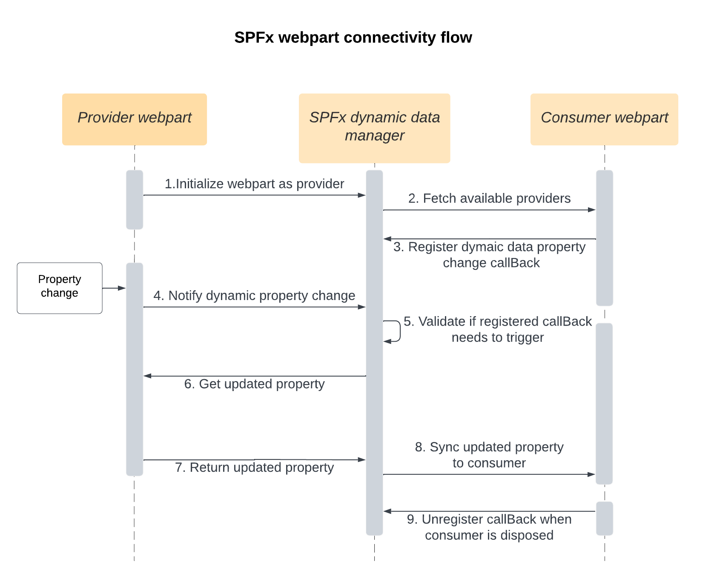

# esri-sharepoint-extensions-samples

Samples around ArcGIS map web part to demonstrate different capabilities and possibilities on the dynamic web part connectivity feature. Each sample has it's own dedicated readme file to explain setup instructions and demonstrated capability.

If you are first time user, please refer to the [instructions](../../#instructions) section. All samples share the same installation process. Once installation is completed, all sample web parts will be available within SharePoint page's web part gallery.

You can head directly to the folders below and start looking around if you'd like.


## Features

* [Sample consumer](./src/webparts/sampleConsumer)

  sample consumer web part to show quarterly sales bar chart for selected data points on the map.


* [Sample provider](./src/webparts/sampleProvider)

  sample provider web part (donut chart) to filter US county polygons on the map.


* [Search sample provider](./src/webparts/searchSampleProvider)

  sample search web part to filter US county polygons on the map.

## Instructions

* clone this repo
* navigate to repo root folder
* in the command line run:
  * `npm install`
  * `gulp bundle --ship`
  * `gulp package-solution --ship`
* from the `sharepoint/solution` folder, deploy the `.sppkg` file to the App catalog in your tenant
* in the site where you want to test this solution
  * add the app named _arc-gis-spfx-examples_
  * edit a page
  * You should be able to see all the sample web parts available in the web part gallery

## SPFx web part connectivity common practice



## Standard for receiving data from ArcGIS map web part

Dynamic data property | Description
----  | ----
layer-selection | Information about selected features and the corresponding layer.
layer-filter | Information about filtered features and the corresponding layers.
esri-dynamic-data-updates | Generic property id for all properties changes.

#### How to subscribe to dynamic data property change?
 Register dynamic data property change callBack via [`registerPropertyChanged`](https://learn.microsoft.com/en-us/javascript/api/sp-component-base/dynamicdataprovider?view=sp-typescript-latest#@microsoft-sp-component-base-dynamicdataprovider-registerpropertychanged-member(1)) method.


```
// This is an example for receiving "layer-selection" dynamic data property

// fetch source map web part instance (assuming there is only one map web part in the SharePoint page)
const mapWebPartSource = this.context.dynamicDataProvider.getAvailableSources().find(availableSource => {
  // component Id for ArcGIS map web part: "74d48445-8546-4cf0-a3ca-2e49279b3887"
  return availableSource.metadata?.componentId === "74d48445-8546-4cf0-a3ca-2e49279b3887";
});

// Please refer to step 3 in the diagram above.
this.context.dynamicDataProvider.registerPropertyChanged(
    mapWebPartSource.dynamicDataSource.id,      // source map web part instance Id
    "layer-selection",                          // dynamic data property Id
    async ()=>{                                 // callback
      // Please refer to step 6 in the diagram above.
      const selectionInfo: ArcGISSelectionData = await mapWebPartSource.getPropertyValueAsync(dynamicDataPropertyId);
    // write your own code to work with selectionInfo
});
```

#### What does dynamic data property look like?

[Detailed Dynamic data property interface](./src/webparts/sampleConsumer/interface.ts#L17)

## Standard for sending data to ArcGIS map web part

#### Available dynamic data property your web part can send

Dynamic data property | Description
----  | ----
esri-dynamic-data | Filter text that your web part can send

#### Detailed Dynamic data property interface (i.e., what your web part can send)

```
interface PublishedDataToEsriMapWebPart {

  // strings for constructing where clause to filter feature layer features on Esri Map Web Part side
  filterText?: string[];

  // ... more to come
}
```

#### How to establish connection and send data

```
// Please make sure the data send from your web part is published through this property id.
// ArcGIS for SharePoint map web part currently only work with this property id.
const sourcePropertyId = "esri-dynamic-data";

class SampleProviderWebPart extends BaseClientSideWebPart<ISampleProviderWebPartProps> implements IDynamicDataCallables {

  // Local data store for the dynamic data property value to be sent (i.e., filter text)
  private currentMessage:  PublishedDataToEsriMapWebPart = undefined;


  public async onInit(): Promise<void> {
    // this line below is important! This enables this web part as a publisher for dynamic data.
    // Please refer to step 1 in the diagram above.
    this.context.dynamicDataSourceManager.initializeSource(this);
    return super.onInit();
  }

  // implement IDynamicDataCallables interface method to define "esri-dynamic-data" dynamic data properties for consumer to consume
  public getPropertyDefinitions(): ReadonlyArray<IDynamicDataPropertyDefinition> {
    // Please refer to step 2 in the diagram above.
    return [
      { id: sourcePropertyId, title: 'ArcGIS Dynamic data' }
    ];
  }

  // implement IDynamicDataCallables interface method to return updated dynamic property value
  public getPropertyValue(propertyId: string) {
    switch (propertyId) {
      case sourcePropertyId:
        // Please refer to step 7 in the diagram above.
        return this.currentMessage;
      }
      throw new Error('Bad property id');
  }
}
```

#### Notify SPFx page context with your dynamic data property update when needed

Notify SPFx page context with your dynamic data property update via [notifyPropertyChanged](https://learn.microsoft.com/en-us/javascript/api/sp-component-base/dynamicdatasourcemanager?view=sp-typescript-latest#@microsoft-sp-component-base-dynamicdatasourcemanager-notifypropertychanged-member(1)) method.

```
// update local dynamic data properties cache with the new value `input`
this.currentMessage: PublishedDataToEsriMapWebPart = input;

// notify subscribers that the selected property value has changed, please refer to step 4 in the diagram above.
this.context.dynamicDataSourceManager.notifyPropertyChanged(sourcePropertyId);


```
## Requirements

* Notepad or your favorite HTML editor
* Web browser with access to the Internet
* Access to Microsoft SharePoint
* Access to ArcGIS for SharePoint product

## Resources
* [SPFx dynamic data](https://learn.microsoft.com/en-us/sharepoint/dev/spfx/dynamic-data)
* [SPFx DynamicDataProvider class](https://learn.microsoft.com/en-us/javascript/api/sp-component-base/dynamicdataprovider)
* [SPFx DynamicDataSourceManager class](https://learn.microsoft.com/en-us/javascript/api/sp-component-base/dynamicdatasourcemanager)
* [ArcGIS for SharePoint Documentation](https://doc.arcgis.com/en/sharepoint/latest/use-maps/get-started-with-arcgis-maps.htm)
* [ArcGIS for SharePoint Blog](https://www.esri.com/arcgis-blog/?s=#&products=esri-maps-sharepoint)
* [twitter@esri](http://twitter.com/esri)

## Issues

Find a bug or want to request a new feature?  Please let us know by submitting an issue.

## Contributing

Esri welcomes contributions from anyone and everyone. Please see our [guidelines for contributing](https://github.com/esri/contributing).

## Licensing
Copyright 2023 Esri

Licensed under the Apache License, Version 2.0 (the "License");
you may not use this file except in compliance with the License.
You may obtain a copy of the License at

   http://www.apache.org/licenses/LICENSE-2.0

Unless required by applicable law or agreed to in writing, software
distributed under the License is distributed on an "AS IS" BASIS,
WITHOUT WARRANTIES OR CONDITIONS OF ANY KIND, either express or implied.
See the License for the specific language governing permissions and
limitations under the License.

A copy of the license is available in the repository's [license.txt]( ./license.txt) file.
